<div align="center">

<h1>⚡ Core Workbench</h1>

<p><strong>NULLS / WORKBENCH</strong> — a sleek, all-in-one Windows system toolkit.<br/>
Monitor your hardware, tame your startup, clean junk, and overlay your FPS — all under one roof.</p>

<p>
  
  
  
  
</p>

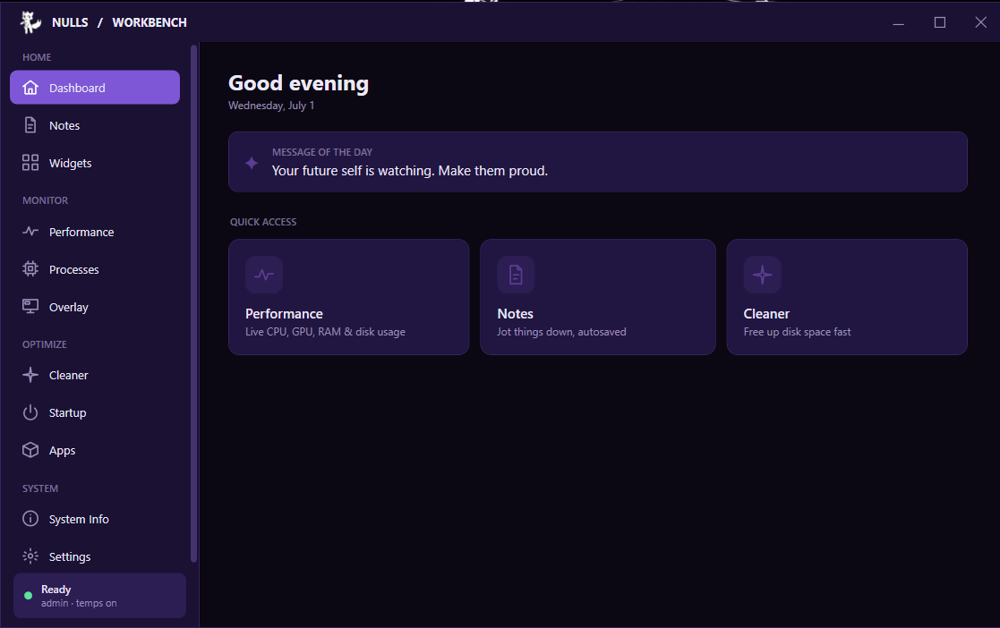

</div>

---

## ✨ What is it?

**Core Workbench** is a personal "Swiss-army" desktop app that bundles the tools I reach for most —
hardware monitoring, drive health, a performance overlay, a cleaner, notes, desktop widgets, and more —
behind one clean, custom-themed interface with a frameless title bar

> Built for myself, kept tidy enough to share.

---

## 🧩 Features

### 🏠 Home

Dashboard greeting & quick-access, a full rich-text **Notes** editor (search, pin, export to RTF, print to PDF),
and Rainmeter-style **desktop widgets** (CPU · GPU · RAM · Clock · combined system bar with sparklines) in floating or desktop mode.

<div align="center">
  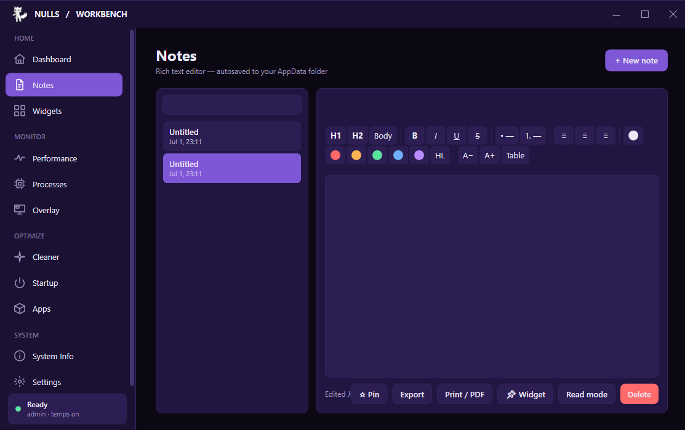
  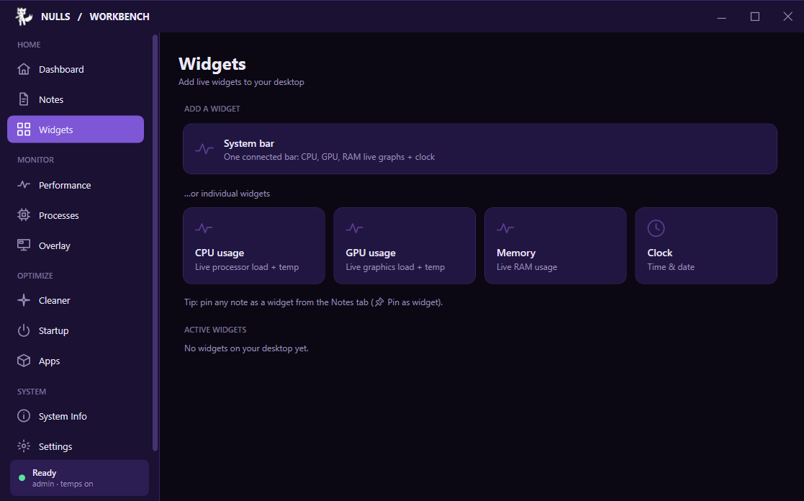
</div>

### 📊 Monitor

Live CPU / GPU / RAM gauges with per-core CPU, clocks, power, temps, VRAM and fan; per-adapter **network** throughput;
CrystalDiskInfo-style **S.M.A.R.T. / NVMe** drive health with a 5-band scale; a mini **task manager**; and an
**MSI Afterburner-style overlay** with real per-game **FPS / frametime / 1% & 0.1% lows** (via in-process ETW — no injection),
toggled by a global hotkey (`Ctrl + Alt + O`).

<div align="center">
  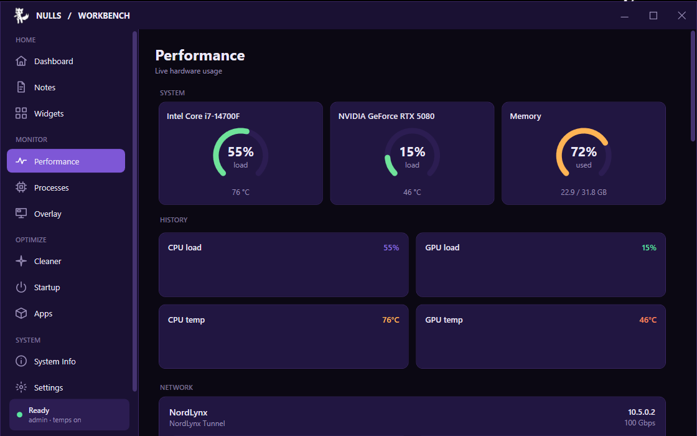
  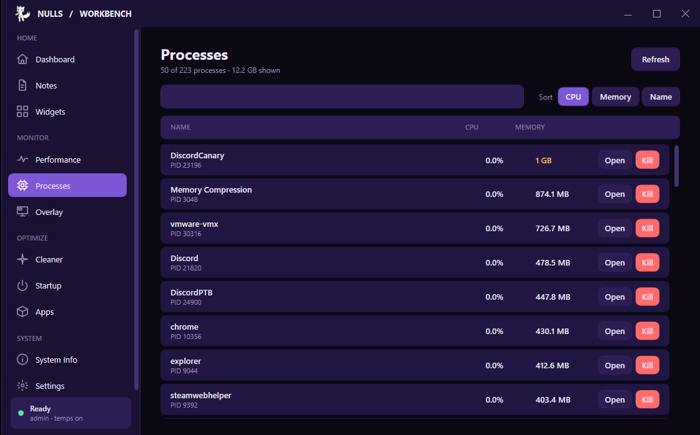
  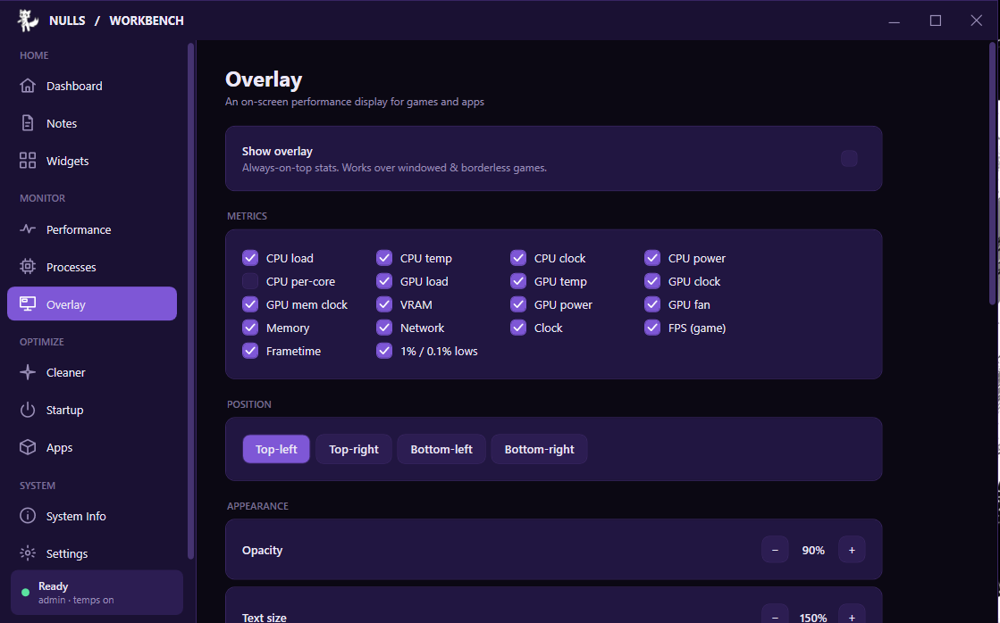
</div>

### 🧹 Optimize

Sweep Windows temp folders and the recycle bin with the **Cleaner**, manage **Startup** entries
(enable / disable / remove), and uninstall programs from a full **Apps** manager with size detection, sort and filters.

<div align="center">
  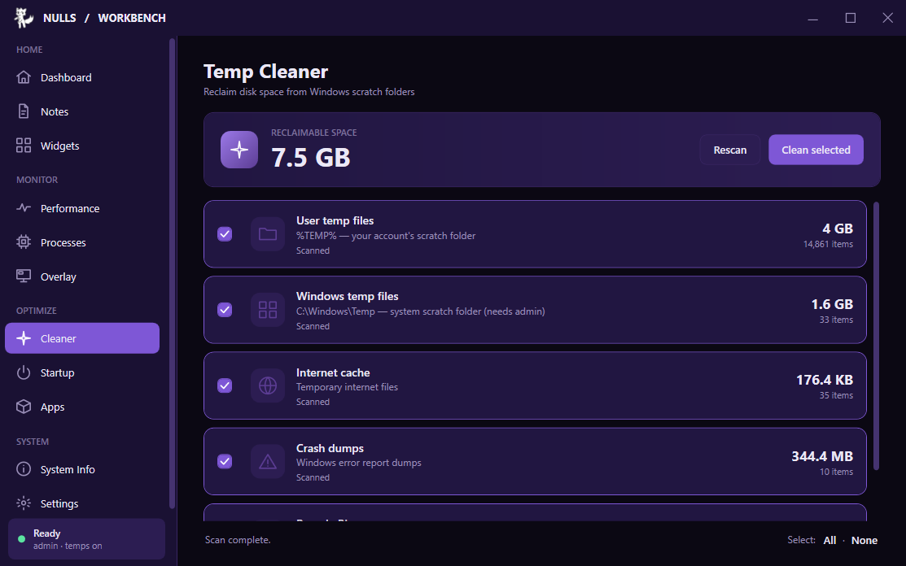
  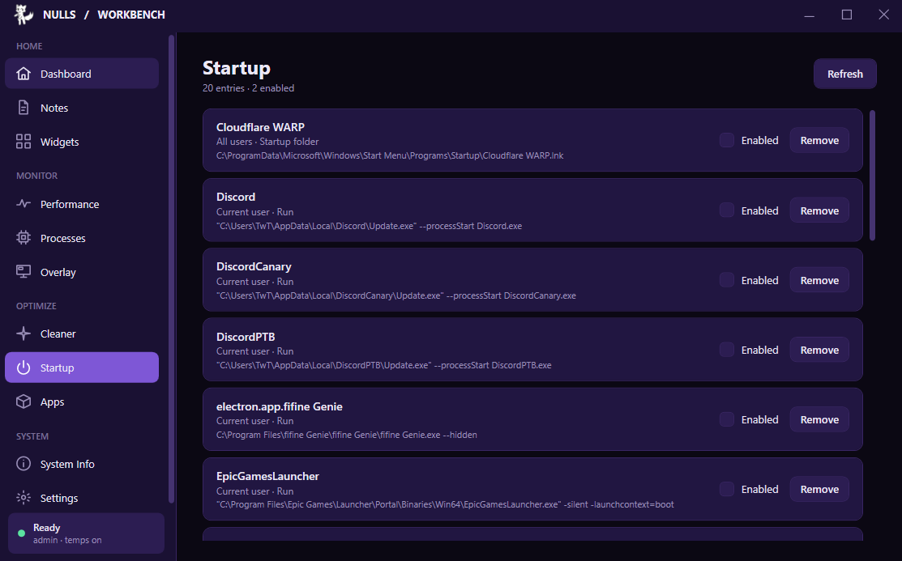
  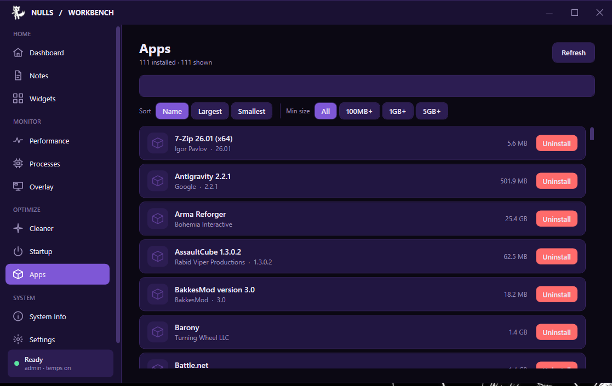
</div>

### ⚙️ System

At-a-glance **System Info** (OS, CPU, RAM per-stick, GPU, motherboard/BIOS, storage), plus **Settings**
for start-with-Windows and tray behaviour — with a themed system tray showing live CPU/GPU/RAM.

<div align="center">
  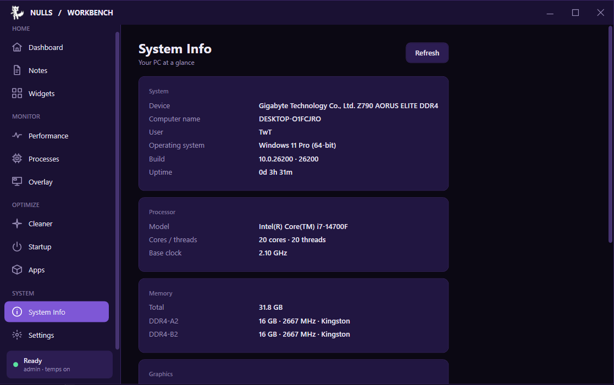
  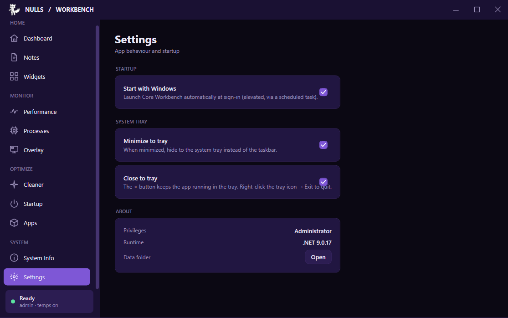
</div>

---

## 🚀 Install

### Option A — Installer (recommended)
1. Download **`CoreWorkbench-Setup.msi`** from the [Releases](../../releases) page.
2. Run it. The app installs to `Program Files\Core Workbench` with Start Menu & Desktop shortcuts.
3. Launch **Core Workbench**.

> The build is **self-contained** — no .NET runtime required on the target machine.

### Option B — Build from source
```bash
git clone https://github.com/TheOriginalNULL/Core-Workbench.git
cd "Core Workbench"
dotnet build -c Release
dotnet run --project "Core Workbench/Core Workbench.csproj"
```

To produce the installer yourself:
```bash
# 1) publish a single self-contained exe
dotnet publish "Core Workbench/Core Workbench.csproj" -c Release -r win-x64 --self-contained true ^
  -p:PublishSingleFile=true -p:IncludeNativeLibrariesForSelfExtract=true

# 2) build the MSI (WiX 5 — free, no OSMF fee)
dotnet tool install --global wix --version 5.0.2
wix build Installer/CoreWorkbench.wxs -arch x64 ^
  -d PublishDir="...\win-x64\publish\" ^
  -d IconFile="...\Assets\SecondaryLogo.ico" ^
  -o Installer\out\CoreWorkbench-Setup.msi
```

---

## 🛠️ Tech Stack

| Area | Tech |
|------|------|
| UI | WPF (.NET 9), custom `WindowChrome` title bar, MVVM-lite |
| Hardware sensors | [LibreHardwareMonitorLib](https://github.com/LibreHardwareMonitor/LibreHardwareMonitor) |
| Drive health | WMI (`MSFT_PhysicalDisk`, `MSFT_StorageReliabilityCounter`) + raw NVMe/ATA S.M.A.R.T. via `DeviceIoControl` |
| FPS overlay | ETW (`Microsoft.Diagnostics.Tracing.TraceEvent`) — DXGI present events, **no injection** |
| Tray | WinForms `NotifyIcon` with a themed dark renderer |
| Installer | WiX Toolset 5 → MSI |

---

## 📌 Notes

- 🔐 **Requires administrator** — temperature sensors and raw S.M.A.R.T. reads need elevation (UAC prompt on launch).
- ✍️ **Unsigned build** — SmartScreen / Smart App Control may warn, since there's no code-signing certificate. Expected for a personal build.
- 🎯 **FPS caveat** — the overlay reads DXGI present events, so it covers DirectX titles; Vulkan/OpenGL-only apps won't report frames.
- 🖥️ **Windows only.**

---

## 🗺️ Roadmap ideas

- [ ] Power plan / Game mode toggle
- [ ] Disk space analyzer
- [ ] Services manager
- [ ] Duplicate finder & secure shredder
- [ ] Vulkan / OpenGL FPS providers

---

<div align="center">
  <sub>Made with 💜 and too much free time · <strong>NULLS</strong></sub>
</div>
